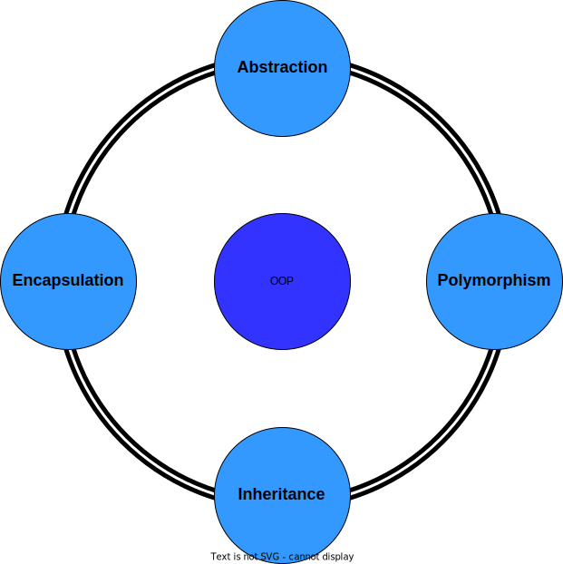

# OOP(Object-Oriented Programming)

Object-oriented programming (OOP) is a programming paradigm based on the concept of "objects", which can contain data and code. The data is in the form of fields (often known as attributes or properties), and the code is in the form of procedures (often known as methods).

[WIKIPEDIA | Object-oriented programming](https://en.wikipedia.org/wiki/Object-oriented_programming)

* Abstration
    * private, public
    * protected(intermediate level)
    * internal

* Encapsulation
    * facilitates code refactoring
    * encourages decoupling [^1]

* Inheritance
    * relationships: "is-a-type-of" or"has-a"
    * Multiple inheritance [^2], mixins [^3]
    * open/closed principle [^4]

* Polymorphism [^5]
    * Ad hoc polymorphism
    * Parametric polymorphism
    * Subtyping
    * Row polymorphism
    * Polytypism

---
[^1]: [WIKIPEDIA | Coupling](https://en.wikipedia.org/wiki/Coupling_(computer_programming))
[^2]: [WIKIPEDIA | Multiple inheritance](https://en.wikipedia.org/wiki/Multiple_inheritance)
[^3]: [WIKIPEDIA | Mixin](https://en.wikipedia.org/wiki/Mixin)
[^4]: classes and functions **should be open for extension, but closed for modification**.
[^5]: [WIKIPEDIA | Polymorphism](https://en.wikipedia.org/wiki/Polymorphism_(computer_science))